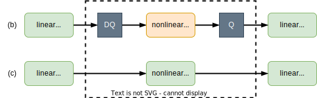

# 查表法量化激活函数

## 前言

本文将讲述基于查表法来实现激活函数的量化。因为目前没有实际负载的实现，所以标注为“口嗨版”。当然后续会抽空做实际负载的实验（目标是 Transformer），争取早日抹掉这个标注。不过实现的单个量化算子，都提供了测试用例。
项目地址：<https://github.com/yehangyang/Activation_Function_Quantization>

## 动机

首先交代一下激活函数量化的需求从何而来。为了提高模型推理速度，一些算子被做成量化算子，在整型域上进行计算（e.g. int8 量化，还有更激进的 int4 量化）。通常情况下线性计算实现量化是比较简单的，因为不是本文讨论重点，这里不做赘述。

而在模型设计中，线性层的后面通常会跟一个非线性层（也就是所谓的激活函数）。例如现在有下图（a）这样一个模型。如果只能对线性层做量化，那么只能得到下图（b）这样的效果，量化和非量化算子之间会穿插很多 Q/DQ 节点（也就是量化和浮点间的转化）。而我们希望看到下图（c）的效果，也就是希望激活函数也能进行量化计算。


观察上图（b），nonlinear 的输出会再次被量化，作为下一个量化 linear 的输入。细想，量化其实同时在边界上和数量上限制了表示范围。以 int8 量化为例，linear 输出的 $X \in [-128, +127]$（边界限制），可由 256 个数表示（数量限制）。此时如果 nonlinear 由浮点实现，则 $X$ 需要被反量化（$x' = scale_x · X$），才能作为浮点 nonlinear 的输入。请不要以为做了反量化变成浮点数了，$x'$ 的边界和数量限制就解除了，它仍旧被限制在 $[-128scale_x, +127scale_x]$，数值表示数量为 256 不变（并且可以和反量化前一一对应）。在浮点域做完 nonlinear 之后，$y = nonlinear(x')$，限制仍然存在（仍然保持一一对应）。为了能成为下一个量化 linear 的输入，需要对 $y$ 量化，$Y = [\frac {y} {scale_y}]$，限制依旧在（一一对应）。费劲周章，最后得到的还是 256 种数值结果，所以我们为什么不借助“一一对应”的传递性，用查表法来得到 nonlinear 的量化结果呢？

总结一下，我们的动机是希望通过量化非线性激活函数来实现全模型的量化（上图（b）到上图（c）的转变），并且根据分析是可以通过查表法来实现量化非线性激活函数，且可以保证无误差。

正如《动机》章节描述，我们将用查表法来实现非线性激活函数的量化。量化非线性激活函数是为了实现图中（c）的 nonlinear(int8) 等效替换（b）的 DQ -> nonlinear(float) -> Q 过程。



## 测试代码

代码地址

不同激活函数的查表实现可能存在差异，但是测试设计肯定是一致的，所以把测试设计放在功能设计前面。测试时需要保证在相同量化输入下，（b）和（c）两者量化输出的数值是完全相等的。如代码块所示，其中：

* L20 表示（c）的虚线框过程，量化结果为quant_output。
* L23~L25 表示（b）的虚线框过程，量化结果为ground_truth_quant_output。
* L28 是元素比较，quant_output应该与ground_truth_quant_output完全相等。

```python linenums="1"
def __check_symmetric_quant(quant_cls: _SymmetryQuant, float_func: Callable, input_amax: float, bit: int,
                            narrow: bool) -> bool:
    """Check whether the output of quant_cls is correct

    Args:
        quant_cls (_SymmetryQuant): an symmetric quantization operator
        float_func (Callable): ground truth function in floating-point
        input_amax (float): the amax of input for quantization
        bit (int): the bit number of quantization
        narrow (bool): Ture: quant_min = -2^(bit - 1) + 1, False: quant_min = 2^(bit - 1)

    Returns:
        bool: Ture: all elements of quantization function output are correct, False: any elements is wrong
    """
    input_shape = (1, 128)
    quant_input = torch.randint(utils.quant_min(bit, narrow), utils.quant_max(bit) + 1, input_shape, dtype=torch.int8)

    # (quant_input) -> quant_func -> (quant_output)
    quant_func = quant_cls(input_amax, bit, narrow)
    quant_output = quant_func(quant_input)

    # (quant_input) -> DQ -> float_func -> Q -> (quant_output)
    ground_truth_float_input = utils.dequantize(quant_input, quant_func.input_scale)
    ground_truth_float_output = float_func(ground_truth_float_input)
    ground_truth_quant_output = utils.quantize(ground_truth_float_output, quant_func.output_scale, bit, narrow)

    # every element should be the same
    return (quant_output == ground_truth_quant_output).all()
```

## 功能代码

代码地址
功能实现的关键是生成查表法用到的映射表。以对称量化为例，获取映射表 table 的流程如下图所示。



代码实现如下面代码块所示，其中：

* L21～L33：生成映射表 table 的代码（在__init__函数中可见）
* L36：前向推理时的查表过程

```python linenums="1"
class _SymmetryQuant(torch.nn.Module):

    def __init__(self,
                 func: Callable,
                 input_amax: float,
                 bit: int,
                 narrow: bool = False,
                 output_amax: float = None) -> None:
        """Initialize quant-input to quant-output mapping table for symmetry quantization.

        Args:
            func (Callable): corresponding standard floating-point function
            input_amax (float): the amax of input for quantization
            bit (int): the bit number
            narrow (bool, optional): True: quant_min = -2^(bit - 1) + 1. Defaults to False, quant_min = -2^(bit - 1)
            output_amax (float, optional): the amax of output for quantization.
                                           Defaults to None, the amax = amax(nonlinear(DQ(quant_input)))
        """
        super().__init__()
        # (input_quant) -> DQ -> (input_float)
        self.__input_scale = input_amax / quant_max(bit)
        input_quant = torch.arange(quant_min(bit, narrow), quant_max(bit) + 1, dtype=torch.int8)
        input_float = input_quant * self.__input_scale

        # (input_float) -> float_func -> Q -> (output_quant)
        output_float = func(input_float)
        output_amax = output_amax if output_amax else torch.absolute(output_float).max()
        self.__output_scale = output_amax / quant_max(bit)
        output_quant = quantize(output_float, self.__output_scale, bit, narrow)

        # adjust sequence of output_quant for easier retrieve
        index = quant_max(bit) if narrow else quant_max(bit) + 1
        self._table = torch.cat((output_quant[index:], output_quant[:index]))

    def forward(self, x: torch.Tensor):
        y = self._table[x.to(torch.int64)]
        return y

    @property
    def input_scale(self):
        return self.__input_scale

    @property
    def output_scale(self):
        return self.__output_scale
```

至此完成非线性激活函数量化查表法的最普适实现，i.e.，适合任何一个非线性激活函数的量化实现（除了 Softmax）。在同一个网络中，可能会包含多个非线性激活函数。如果每个激活函数都使用查表法实现，以 int8 量化为例，每个激活函数的查表实现需要花费 256 Byte 的内存。如果激活函数数量稍多一点，内存占用还是比较厉害的。不过如果我们稍加限制，譬如在同一个网络中，同一种激活函数的输入/输出 scale 能分别限制为相同，或者限制在少量组合中，那么查表法使用的表格数量就能减少。e.g., 一个网络中有 30 个 Sigmoid 激活函数，其中 10 个的输入/输出 scale 是相同的，那么就能共用一个表；如果条件允许，30 个 Sigmoid 的输入/输出 scale 都分别相同，那就都能共用同一个表，内存占用一下子缩小 30 倍。

话说回来，这个内存占用与一个卷积核 [N, C, H, W] = [4, 8, 3, 3] 差不多（同样以 int8 量化来比较），而通常的卷积核是该例子的好几倍。

接下来的小节会根据各激活函数的特性，给出一些特例设计，试图进一步提升推理性能（通常是内存和计算之间的博弈）。还会讨论如何实现 Softmax 的量化。

## Softmax

表达公式：$y_i = \frac{e^{x_i}}{\sum_{i}^{n} e^{x_i}}$

函数曲线：没有固定曲线

### 数学推演

#### 消除 max

计算 softmax 的第一步通常都是做如下这样一个等价变化，来保证求和时不会发生数据溢出，

$$
y_i = \frac{e^{x_i}}{\sum_{i}^{n} e^{x_i}} = \frac{e^{x_i - offset}}{\sum_{i}^{n} e^{x_i-offset}}, offset = \max_{i \in n}(x_i)
$$

随后将问题拆解为如何得到 $e^{x_i - \max_{i \in n}(x_i)}$。代入量化的表达式 $x_i = scale_x X_i$，得，

$$
e^{scale_x X_i - \max_{i \in n}(scale_x X_i)} = e^{scale_x(X_i - \max_{i \in n}(X_i))}
$$

对于 $X$（量化 tensor）而言，

$$
\max_{i \in n}(X_i) \le Q_{max}, i.e., scale_x \max_{i \in n}(X_i) \le scale_x Q_{max}
$$

于是将 $offset$ 设定为 $scale_x Q_{max}$，等价变化仍然成立，同时避免求和时发生数据溢出。即，

$$
y_i = \frac {e^{scale_x X_i - scale_x Q_{max}}}{\sum_{i}^{n}e^{scale_x X_i - scale_x Q_{max}}} = \frac {e^{scale_x (X_i - Q_{max})}} {\sum_{i}^{n} e^{scale_x (X_i - Q_{max})}}
$$

$$
t_i = e^{scale_x(X_i - Q_{max})}, t_i \in (0, 1)
$$

正如推演公式所示，这种方式可以省去求最大值的操作。

#### 确定分母映射表

我的目标是实现 softmax 的全量化，所以也会对 $t_i$ 做量化，在整数域进行计算。
为了能实现对 $t_i$ 做量化，目前缺少的条件是 $t_i$ 输出的量化 $scale$ 值。于是这一小节将推演如何确定 $t_i$ 的输出量化 $scale$。根据前面的推演，简化公式，并带入 $t_i$ 的量化表达 $t_i = scale_t T_i$，化简如下，

$$
y_i = \frac {t_i} {\sum_{i}^{n} t_i} = \frac {scale_t T_i} {\sum_{i}^{n} scale_t T_i} = \frac {T_i} {\sum_{i}^{n}T_i}
$$

至此证明 $t_i$ 的量化输出可以直接用于计算，i.e., 可以在整数域进行累加和除法操作。

接下来要确定 $scale_t$ 的取值。在确定 $scale_t$ 的取值时，需要结合硬件的整数累加器来考虑。看到整数累加，通常会引起做量化同学的警惕。累加结果（包括中间结果）会被存到硬件的累加器（$acc$）中。而累加器位宽（$bit_{acc}$）通常都是固定的。位宽固定，累加的上限也就确定，令其为 $Q_{acc}^{max} = 2^{bit_{acc} - 1} - 1$，在 softmax 这个场景中，甚至可以用无符号表示，因为 $T$ 肯定大于零。$T$ 的每个元素值大小是千变万化的，$T$ 的元素个数 $n$ 是可以确定的。根据 $Q_{acc}^{max}$ 和 $n$，可以作以下约束，

$$
\max_{i \in n}(T_i) n \le Q_{acc}^{max}
$$

$$
\max_{i \in n}(T_i) \le \frac {Q_{acc}^{max}} {n}
$$

为了充分利用 $acc$ 的每个 $bit$ 位，令

$$
\max_{i \in n}(T_i) =\left \lfloor  \frac {Q_{acc}^{max}} {n} \right \rfloor
$$

由前面的推理 $t_i \in (0, 1)$，根据计算量化公式，$scale = \frac {F_{max}} {Q_{max}}$，可得，

$$
scale_t = \frac {\max_{i \in n}(t_i)} {\max_{i \in n}(T_i)} = \frac {1} {\max_{i \in n}(T_i)}
$$

就此确定分母中 $T$ 的量化缩放因子 $scale_t = \frac {1} {\max_{i \in n}T_i}$。并且 $\frac {1} {\max_{i \in n}T_i}$ 是允许的最小 $scale_t$，如果 $scale_t > \frac {1} {\max_{i \in n}T_i}$，就存在 $acc$ 溢出的风险。

综上，

$$
scale_t = \frac {1} {\max_{i \in n}T_i} = \frac {1} {\left \lfloor  \frac {Q_{acc}^{max}} {n} \right \rfloor}
$$

所以只要确定 $acc$ 的位宽 $bit_{acc}$（用来确定 $Q_{acc}^{max}$）和元素个数 $n$，就能确定分母中 $T$ 的缩放因子 $scale_t$。至此的公式推演可以支撑实现 X -> T 的查表实现。

#### 确定分子映射表

首先回到简化公式，$y_i = \frac {T_i} {\sum_{i \in n} T_i}$，带入量化表达 $y_i = scale_y Y_i$ 得，

$$
y_i = scale_y Y_i = \frac {T_i} {\sum_{i \in n} T_i}
$$

$$
Y_i = \frac { \frac {T_i} {scale_y} } {\sum_{i \in n} T_i}
$$

因为 $y_i \in (0, 1)$，所以 $scale_y < 1$。如果 $\frac {T_i} {scale_y}$ 只保留整数相当于又做了一次量化（第一次是 $T_i = \frac {t_i} {scale_t}$）。于是需要确定用多大位宽来存放 $\frac {T_i} {scale_y}$，可以保证不发生溢出问题。

因为 $\max_{i \in n}y \in [\frac {1} {n}, 1)$ 当 $n = 1$ 时, $\max_{i \in n} y_i = 1$ 即 $\min(\max_{i \in n}y_i) = \frac {1} {n}$

再结合 $scale_y = \frac { \max_{i \in n} y} {Q_{output}^{max}}$ 可得，

$$
\min(scale_y) = \frac {\min(\max_{i \in n}y)} {Q_{output}^{max}} = \frac {1} {n Q_{output}^{max}}
$$

于是，

$$
\max( \frac {T_i} {scale_y}) = \frac {\max_{i \in n}T_i} {\min(scale_y)} = \frac {Q_{acc}^{max}} {n} n Q_{output}^{max} = Q_{acc}^{max} Q_{output}^{max}
$$

等式的推论是，分子 $\frac {T_i} {scale_y}$ 需要位宽 $bit_{acc} + bit_{output}$ 来存放，这样可以完全避免溢出问题。将之前的等式重新梳理一下，

$$
Y_i = \frac { \frac {T_i} {scale_y}} {\sum_{i}^{n}T_i} = \frac { \frac {t_i} {scale_t scale_y}} {\sum_{i}^{n} T_i} = \frac {P_i} {\sum_{i}^{n}T_i}
$$

其中 $P_i = \frac {t_i} {scale_t scale_y}$，也就是将两次量化等效为一次。说等效其实不合适，因为两次并一次，可以减少一次 round 误差。至此的公式推演可以支撑实现 X -> P 的查表实现。

### 功能代码

根据等式关系，

$$
Y_i = \frac {P_i} {\sum_{i}^{n}T_i}
$$

$$
P_i = \left \lfloor \frac {t_i} {scale_t scale_y} \right \rfloor
$$

$$
T_i = \left \lfloor \frac {t_i} {scale_t} \right \rfloor
$$

$$
t_i = e^{scale_x (X_i - Q_{input}^{max})}
$$

$$
scale_t = \frac {1} {\max_{i \in n} T_i} = \frac {1} {\left \lfloor \frac {Q_{acc}^{max}} {n} \right \rfloor}
$$

可以设计两个映射表分别是 X -> T 和 X -> P，其中 $X$ 用 $bit_{input}$ 位宽存放，$T$ 与 $acc$ 保持一致用 $bit_{acc}$ 位宽存放，$P$ 用 $bit_{acc} + bit_{output}$ 位宽存放。

代码地址

```python linenums="1"
class Softmax(torch.nn.Module):

    def __init__(self,
                 dim_len: int,
                 input_bit: int,
                 input_amax: float,
                 input_unsign: bool,
                 output_bit: int,
                 output_amax: float,
                 output_unsign: bool = True,
                 acc_bit: int = 16,
                 narrow: bool = False,
                 dim: int = None) -> None:
        super().__init__()

        assert (input_bit <= 8)

        self._dim = dim if dim else -1
        self._dim_len = dim_len

        self.input_qconfig = QuantConfig(bit=input_bit, narrow=narrow, unsign=input_unsign, amax=input_amax)
        self.output_qconfig = QuantConfig(bit=output_bit, narrow=narrow, unsign=output_unsign, amax=output_amax)

        # (input_quant) -> minus_max -> DQ -> float_func -> (exp_float)
        input_quant = self.input_qconfig.range.to(torch.int32)
        input_quant_minus_max = input_quant - self.input_qconfig.quant_max
        input_float_minus_max = self.input_qconfig.dequantize(input_quant_minus_max)
        exp_float = torch.exp(input_float_minus_max)

        acc_quant_max = quant_max(bit=acc_bit, unsign=False)

        # denominator
        denominator_scale = 1 / (acc_quant_max // dim_len)  # denominator allowed min quant scale
        self.denominator_element_qconfig = QuantConfig(bit=acc_bit, narrow=False, unsign=False, scale=denominator_scale)
        # (exp_float) -> Q -> (denominator_element_quant)
        denominator_element_quant = self.denominator_element_qconfig.quantize(exp_float)

        # numerator
        numerator_bit = acc_bit + output_bit
        numerator_scale = denominator_scale * self.output_qconfig.scale
        self.numerator_qconfig = QuantConfig(bit=numerator_bit, narrow=False, unsign=False, scale=numerator_scale)
        # (exp_float) -> Q -> (numerator_quant)
        numerator_quant = self.numerator_qconfig.quantize(exp_float)

        # adjust sequence of output_quant for easier retrieve
        if input_unsign:
            self._denominator_element_table = denominator_element_quant
            self._numerator_table = numerator_quant
        else:
            index = self.input_qconfig.quant_max if narrow else self.input_qconfig.quant_max + 1
            self._denominator_element_table = torch.cat(
                (denominator_element_quant[index:], denominator_element_quant[:index]))
            self._numerator_table = torch.cat((numerator_quant[index:], numerator_quant[:index]))

    def forward(self, x: torch.Tensor):
        denominator_element = self._denominator_element_table[x.to(torch.int64)]
        denominator = torch.sum(denominator_element, dim=self._dim)

        numerator = self._numerator_table[x.to(torch.int64)]

        y = numerator / denominator
        y = torch.clamp(y, self.output_qconfig.quant_min, self.output_qconfig.quant_max)
        y = y.to(self.output_qconfig.dtype)
        return y
```

### 测试代码

代码地址

测试代码和测试设计中提到的会有所不同。因为 Softmax 不是简单查表就能实现的，过程中存在累加和除法，所以存在无法避免的误差。在测试代码中，将量化输出的最大绝对值误差（max absolute error）限定在 1 以内（包括 1），也就是等价浮点输出误差在 output_quant_scale 以内，对应代码块 L19。

```python linenums="1"
def _check_symmetric_quant_table_softmax(dim_len_range: Tuple[int],
                                         input_bit_range: Tuple[int],
                                         input_amax_range: Tuple[float],
                                         input_unsign_range: Tuple[bool],
                                         output_bit_range: Tuple[int],
                                         output_amax_range: Tuple[float],
                                         output_unsign_range: Tuple[bool] = (False,)):
    for dim_len in tqdm(range(dim_len_range[0], dim_len_range[1]), desc=f'Testing {Softmax}'):
        for input_bit in input_bit_range:
            for input_amax in input_amax_range:
                for input_unsign in input_unsign_range:
                    for output_bit in output_bit_range:
                        for output_amax in output_amax_range:
                            for output_unsign in output_unsign_range:
                                for narrow in (True, False):
                                    max_absolute_error = __check_symmetric_quant_table_softmax(
                                        dim_len, input_bit, input_amax, input_unsign, output_bit, output_amax,
                                        output_unsign, narrow)
                                    if max_absolute_error > 1:
                                        print(f'dim_len = {dim_len}, input_bit = {input_bit}, input_amax = {input_amax}, input_unsign = {input_unsign}, '\
                                                f'output_bit = {output_bit}, output_amax = {output_amax}, output_unsign = {output_unsign}, '\
                                                f'narrow = {narrow} max_absolute_error is {max_absolute_error}!')
                                        return False

    return True
```

备注：测试代码中未添加 $bit_{acc}$ 的遍历测试。经手动调节 $bit_{acc}$ 大小发现，$bit_{acc}$ 越大，误差越小。$bit_{acc}$ 较小时，误差很大，测试无法通过。$bit_{acc}$ 足够大时，误差可以控制在允许范围内，测试能通过。此时 $bit_{acc}$ 再增大会发现，绝对值误差为 1 的数量会逐渐减少。有兴趣的朋友也可以试一下。究其原因，是 $bit_{acc}$ 位宽增大，保留了更多原来浮点数末尾的小数信息，保留的越多累加后的误差也就越小。

### 内存开销

#### 映射表

相较普通的浮点计算，Softmax 的量化查表实现，需要储存两张映射表。按照设定，

* 量化输入比特位数：$bit_{input}$
* 累加器比特位数：$bit_{acc}$
* 量化输出比特位数：$bit_{output}$

可以得到，

* X -> T 映射表内存大小计算公式，$2^{bit_{input}} bit_{acc} (bits) = \frac {2^{bit_{input}} bit_{acc}} {8} (Bytes)$
* X -> P 映射表内存大小计算公式，$2^{bit_{input}} (bit_{acc} + bit_{output}) (bits)
= \frac {2^{bit_{input}} (bit_{acc} + bit_{output})} {8} (Bytes)$

带入具体参数的具象感受如下表所示，

| $bit_{input}$ | $bit_{acc}$ | $bit_{output}$ | X -> T(Bytes) | X -> P(Bytes) | 总和(Bytes) |
| ------------- | ----------- | -------------- | ------------- | ------------- | ----------- |
| 8             | 16          | 8              | 512           | 768           | 1280        |
| 8             | 32          | 8              | 1024          | 1280          | 2304        |
| 4             | 16          | 4              | 32            | 40            | 72          |

#### 中间量

按照 Python 代码实现流程，会有两个中间变量分子 $P$ 和分母 $\sum_{i}^{n}T_i$。抛开 Python 的代码实现（Python 代码只体现了量化的实现），转而思考 C/C++ 的代码优化（或者硬件设计的优化）。

* 首先讨论 $\sum_{i}^{n}T_i$ 的优化过程。通常的做法是，在求和前将累加器清零。逐个元素查表得到 $T_i$ 并累加到累加器上。这样无需提供暂存 tensor。
* 再来讨论 $P$ 的优化过程。得到 $\sum_{i}^{n}T_i$ 之后，逐个元素查表得到 $P_i$ 并计算 $\frac {P_i} {\sum_{i}^{n}T_i} = Y_i$。这样也无需提供暂存 tensor。

综上所述，无需为中间量提供大内存。

### 小结

量化 Softmax 带来额外的内存消耗来自两个映射表，且内存消耗在可接受范围内（以 $bit_{input} = 8,bit_{acc} = 32,bit_{output} = 8$ 为例，相当于引入了一个大小为 [N, C, H, W] = [64, 32, 3, 3] 的 int8 卷积核）。
